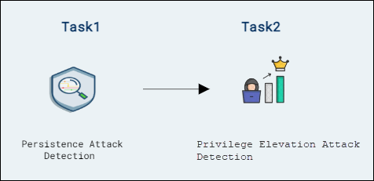
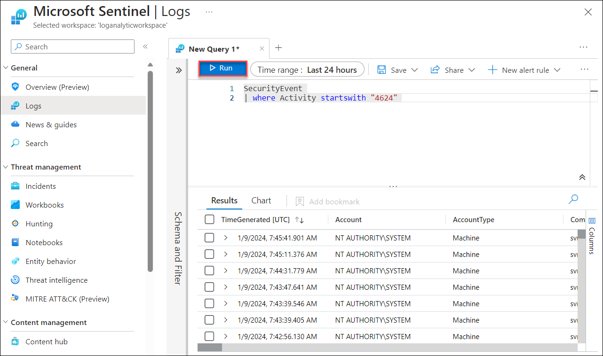
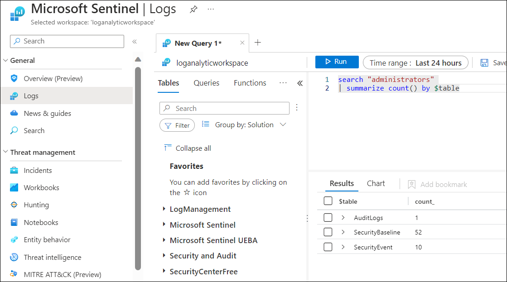
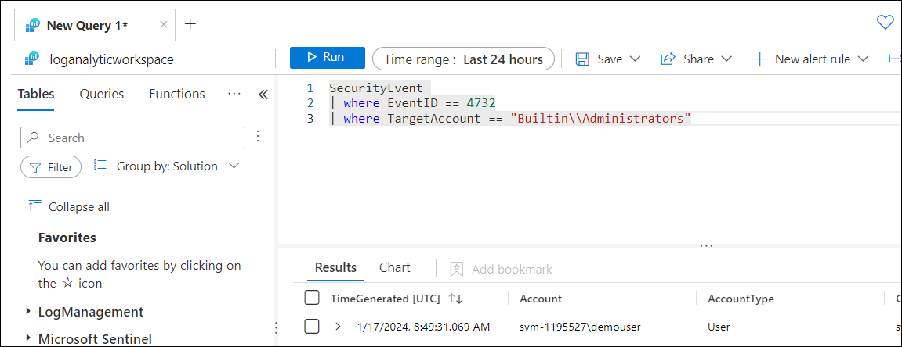
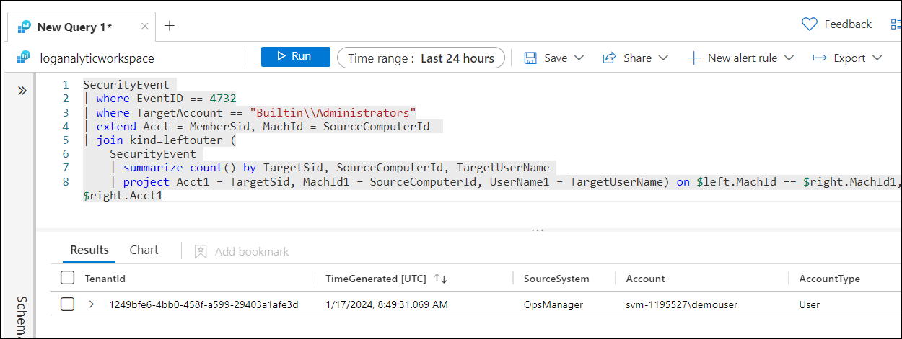
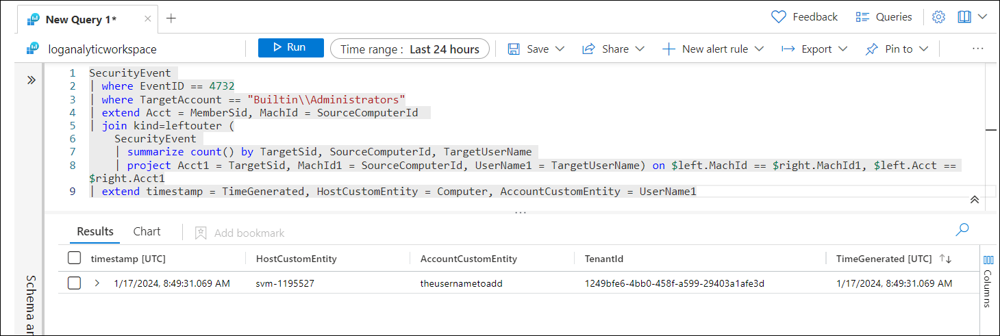
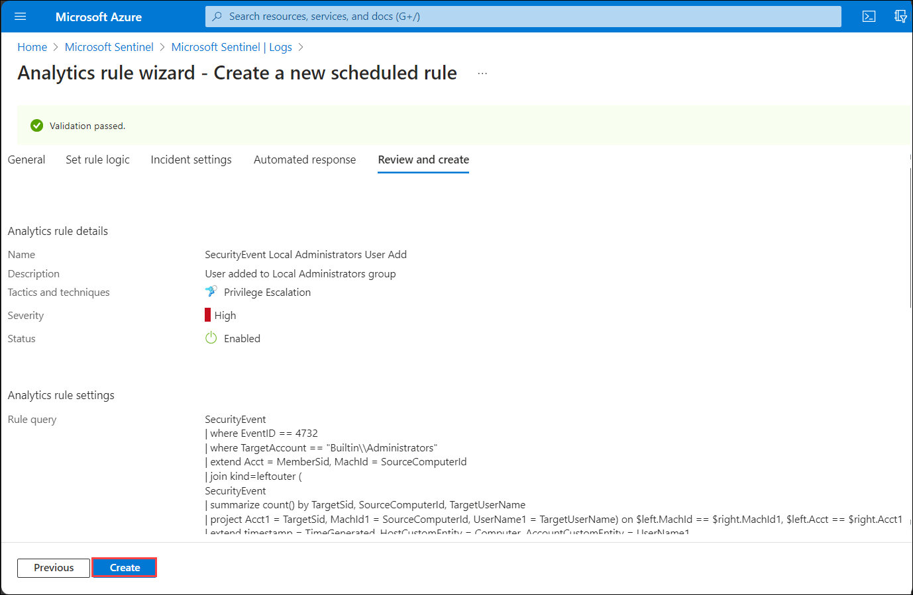

# Lab 04 - Create Detections

## Lab scenario

You are a Security Operations Analyst working at a company that implemented Microsoft Sentinel. You are going to work with Log Analytics KQL queries and from there, you will create custom analytics rules to help discover threats and anomalous behaviors in your environment.

Analytics rules search for specific events or sets of events across your environment, alert you when certain event thresholds or conditions are reached, generate incidents for your SOC to triage and investigate, and respond to threats with automated tracking and remediation processes.

## Lab objectives
 In this lab, you will understand the following:

- Task 1: Create a Playbook in Microsoft Sentinel
- Task 1: Update a Playbook in Microsoft Sentinel
- Task 3: Persistence Attack Detection
- Task 4: Privilege Elevation Attack Detection

## Estimated timing: 30 minutes

## Architecture Diagram

  

### Task 1: Create a Playbook in Microsoft Sentinel.

In this task, you will create a Logic App that is used as a Playbook in Microsoft Sentinel.

1. In the Microsoft Edge browser, open a new tab and paste https://github.com/Azure/Azure-Sentinel to navigate to Microsoft Sentinel on GitHub.

1. Scroll down and select the **Solutions** folder.

1. Next select the **SentinelSOARessentials** folder, then the **Playbooks** folder.

1. Select the **Post-Message-Teams** folder.

1. In the readme.md box, scroll down to the *Quick Deployment* section, **Deploy with incident trigger (recommended)** and select the **Deploy to Azure** button.

     

1. Make sure your Azure Subscription is selected.

1. For Resource Group, select **threat-xdr** and select **OK**.

1. Leave **(US) East US** as the default value for *Region*.

1. Rename the *Playbook Name* to **PostMessageTeams-OnIncident** and select **Review + create**.

1. Now select **Create**.

    >**Note:** Wait for the deployment to finish before proceeding to the next task. It may take a couple of minutes to deploy.

### Task 2: Update a Playbook in Microsoft Sentinel.

In this task, you will update the new playbook you created with the proper connection information.

1. In the Search bar of the Azure portal, type *Sentinel*, then select **Microsoft Sentinel**.

1. Select your Microsoft Sentinel Workspace **loganalyticworkspace**.

1. Select the **Automation** from the Configuration area and then select the **Active Playbooks** tab, If **PostMessageTeams-OnIncident** is not visible refresh the page and check.

1. Select the **PostMessageTeams-OnIncident** playbook and click on it to go to the logic App page.

     

1. On the Logic App page for *PostMessageTeams-OnIncident*, in the center menu, select **Edit**.
   
     

1. Select the *first* block **Microsoft Sentinel Incident(Preview)**.

1. Select the **Change connection** link.
   
    

1. Select **Add new** and select **Sign in**. In the new window, select your Azure subscription admin credentials when prompted. The last line of the block should now read “Connected to your-admin-username”.

1. Now select the *second block*, **Connections**.

1. Select **Add new** and select your Azure admin credentials when prompted. The last line of the block should now read “Connected to your-admin-username”.
   
     

1. The block has now been renamed to **Post a message (V3)**, at the end of the Team field, select the X to clear the contents. The field is changed to a drop-down with a listing of the available Teams from Microsoft Teams. Select **SOC**.

1. Do the same for the Channel field, select the **X** at the end of the field to clear the contents. The field is changed to a drop-down with a listing of the Channels of the SOC Teams. Select **New Alerts**. 

1. Under the **Message** section, type **Entities: (1)** and select **Entities (2)** dynamic content from the right panel.

   

1. Select **Save** on the command bar. The Logic App will be used in a future lab.
   
   


### Task 3: Persistence Attack Detection

In this task, you will create a detection for the first attack of the previous exercise.

1. In the Search bar of the Azure portal, type *Sentinel*, then select **Microsoft Sentinel**.

1. Select the Microsoft Sentinel Workspace you created earlier.

1. Select **Logs** from the *General* section.

1. **Run** the following KQL Statement again to recall the tables where we have this data:

    ```KQL
    search "temp\\startup.bat"
    ```
    
         
1. The table *SecurityEvent* looks to have the data already normalized and is easy for us to query. Expand the row to see all the columns related to the record.

1. From the results, we now know that the Threat Actor is using reg.exe to add keys to the Registry key and the program is located in C:\temp. **Run** the following statement to replace the *search* operator with the *where* operator in our query:

    ```KQL
    SecurityEvent 
    | where Activity startswith "4624" 
    ```
    

1. It is important to help the Security Operations Center Analyst by providing as much context about the alert as you can. This includes projecting Entities for use in the investigation graph. **Run** the following query:

    ```KQL
    SecurityEvent 
    | where Activity startswith "4624" 
    | extend timestamp = TimeGenerated, HostCustomEntity = Computer, AccountCustomEntity = SubjectUserName
    ```

1. Now that you have a good detection rule, in the Logs window, select the **+ New alert rule** in the command bar and then select **Create Microsoft Sentinel alert**. This will create a new Scheduled rule.
   
   **Hint:** You might need to select the ellipsis (...) button in the command bar.

1. This starts the "Analytics rule wizard". For the *General* tab type:

    |Setting|Value|
    |---|---|
    |Name|Startup RegKey|
    |Description|Startup RegKey in c:\temp|
    |Tactics|Persistence|
    |Severity|High|

1. Select **Next: Set rule logic >** button.

1. On the *Set rule logic* tab, the *Rule query* should be populated already with your KQL query, as well as the entities under *Alert enrichment - Entity mapping*.

    |Entity|Identifier|Data Field|
    |:----|:----|:----|
    |Account|FullName|AccountCustomEntity|
    |Host|Hostname|HostCustomEntity|

1. If **Hostname** isn't selected for *Host* Entity, select it from the drop-down list.

1. For *Query scheduling* set the following:

    |Setting|Value|
    |---|---|
    |Run Query every|5 minutes|
    |Lookup data from the last|1 Days|

    >**Note:** We are purposely generating many incidents for the same data. This enables the Lab to use these alerts.

1. Leave the rest of the options with the defaults. Select **Next: Incident settings>** button.

1. For the *Incident settings* tab, leave the default values and select **Next: Automated response >** button.

1. On the *Automated response* tab under *Automation rules*, select **Add new**.

1. Use the settings in the table to configure the automation rule.

    |Setting|Value|
    |:----|:----|
    |Automation rule name|Startup RegKey|
    |Trigger|When incident is created|
    |Actions |Run playbook|
   
1. A second drop-down menu appears with an *Information (i)* message regarding playbook permissions and a **Manage playbook permissions link**

    >**Note:** The playbooks will appear greyed out in the drop-down list until permissions are configured.

1. Select the **Manage playbook permissions link**

1. On the *Manage Permissions* page, select the **threat-xdr** resource group, and select **Apply**.

1. From the drop-down menu, select the playbook **PostMessageTeams-OnIncident**, if required refresh the page.

1. Select **Apply**

    

1. Select the **Next: Review >** button.
  
1. On the *Review and create* tab, select the **Save** button to create the new Scheduled Analytics rule.

### Task 4: Privilege Elevation Attack Detection

In this task, you will create a detection for the second attack of the previous exercise.

1. In the Microsoft Sentinel portal, select **Logs** from the General section in case you navigated away from this page.

1. **Run** the following KQL Statement to identify any entry that refers to administrators:

    ```KQL
    search "administrators" 
    | summarize count() by $table
    ```

    

1. The result might show events from different tables, but in our case, we want to investigate the SecurityEvent table. The EventID and Event that we are looking at is "4732 - A member was added to a security-enabled local group". With this, we will identify adding a member to a privileged group. **Run** the following KQL query to confirm:

    ```KQL
    SecurityEvent 
    | where EventID == 4732
    | where TargetAccount == "Builtin\\Administrators"
    ```

   

1. Expand the row to see all the columns related to the record. The username of the account added as Administrator does not show. The issue is that instead of storing the username, we have the Security IDentifier (SID). **Run** the following KQL to match the SID to the username that was added to the Administrators group:

    ```KQL
    SecurityEvent 
    | where EventID == 4732
    | where TargetAccount == "Builtin\\Administrators"
    | extend Acct = MemberSid, MachId = SourceComputerId  
    | join kind=leftouter (
        SecurityEvent 
        | summarize count() by TargetSid, SourceComputerId, TargetUserName 
        | project Acct1 = TargetSid, MachId1 = SourceComputerId, UserName1 = TargetUserName) on $left.MachId == $right.MachId1, $left.Acct == $right.Acct1
    ```

    

1. Extend the row to show the resulting columns, in the last one, we see the name of the added user under the *UserName1* column we *project* within the KQL query. It is important to help the Security Operations Analyst by providing as much context about the alert as you can. This includes projecting Entities for use in the investigation graph. **Run** the following query:

    ```KQL
    SecurityEvent 
    | where EventID == 4732
    | where TargetAccount == "Builtin\\Administrators"
    | extend Acct = MemberSid, MachId = SourceComputerId  
    | join kind=leftouter (
        SecurityEvent 
        | summarize count() by TargetSid, SourceComputerId, TargetUserName 
        | project Acct1 = TargetSid, MachId1 = SourceComputerId, UserName1 = TargetUserName) on $left.MachId == $right.MachId1, $left.Acct == $right.Acct1
    | extend timestamp = TimeGenerated, HostCustomEntity = Computer, AccountCustomEntity = UserName1
    ```

   

1. Now that you have a good detection rule, in the Logs window, select **+ New alert rule** in the command bar and then select **Create Microsoft Sentinel alert**. **Hint:** You might need to select the ellipsis (...) button in the command bar.

1. This starts the "Analytics rule wizard". For the *General* tab type:

    |Setting|Value|
    |---|---|
    |Name|**SecurityEvent Local Administrators User Add (1)**|
    |Description|**User added to Local Administrators group (2)**|
    |Tactics|**Privilege Escalation (3)**|
    |Severity|**High (4)**|

1. Select **Next: Set rule logic > (5)** button. 

   

1. On the *Set rule logic* tab, the *Rule query* should be populated already with your KQL query, and the details for entities under *Alert enrichment - Entity mapping*.

    |Entity|Identifier|Data Field|
    |:----|:----|:----|
    |Account|FullName|AccountCustomEntity|
    |Host|Hostname|HostCustomEntity|

1. For *Query scheduling* set the following:

    |Setting|Value|
    |:---|:---|
    |Run Query every| **5 minutes (1)** |
    |Lookup data from the last| **1 Days (2)**|

    >**Note:** We are purposely generating many incidents for the same data. This enables the Lab to use these alerts.

1. Leave the rest of the options with the defaults. Select **Next: Incident settings> (3)** button.

   

1. For the *Incident settings* tab, leave the default values and select **Next: Automated response >** button.

1. On the *Automated response* tab under *Automation rules*, select **Add new (1)** and Use the settings in the table to configure the automation rule Select **Apply (6)**.

   |Setting|Value|
   |:----|:----|
   |Automation rule name|**SecurityEvent Local Administrators User Add (1)**|
   |Trigger|**When incident is created (2)**|
   |Actions |**Run playbook (3)**|
   |playbook |**PostMessageTeams-OnIncident (4)**|

   >**Note:** You have already assigned permissions to the playbook, so it must be available if not click on manage permissions and select it manually and it will be available by now

   

1. Select the **Next: Review and create >** button.
  
1. On the *Review and create* tab, select the **Save** button to create the new Scheduled Analytics rule.

   

   > **Congratulations** on completing the task! Now, it's time to validate it. Here are the steps:
    > - Click the Lab Validation tab located at the upper right corner of the lab guide section and navigate to the Lab Validation tab.
    > - Hit the Validate button for the corresponding task.
    > - If you receive a success message, you can proceed to the next task. If not, carefully read the error message and retry the   
        step, following the instructions in the lab guide.
    > - If you need any assistance, please contact us at labs-support@spektrasystems.com. We are available 24/7 to help you out.

## Review
In this lab you have completed the following tasks:
- Persistence Attack Detection
- Privilege Elevation Attack Detection

