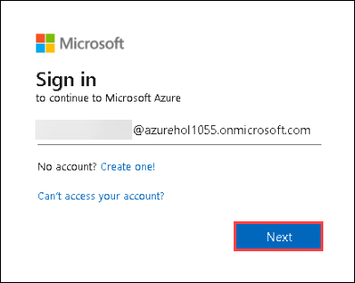
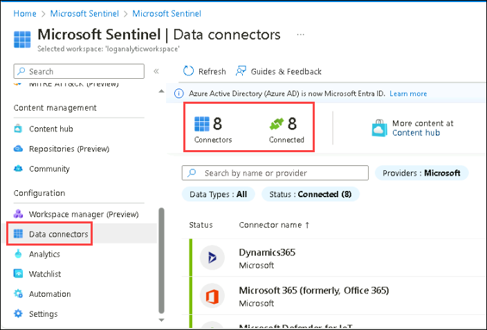

# Lab 01 - Review and explore sentinel workspace

## Lab scenario

In this lab, participants will explore a pre-configured Azure Sentinel workspace, investigating security incidents, configuring automated responses, and analyzing data to strengthen threat detection and response capabilities within the Azure environment.

You are a Security Operations Analyst working at a company that is implementing Microsoft Defender for Endpoint. Your manager plans to onboard a few devices to provide insight into required changes to the Security Operations (SecOps) team response procedures.
You start by initializing the Defender for the Endpoint environment. Next, you onboard the initial devices for your deployment by running the onboarding script on the devices

## Lab objectives
 In this lab, you will perform the following:
 - Task 1: Log in to Azure Portal and verify the pre-deployed resources
 - Task 2: Explore Sentinel workspace
 - Task 3: Onboard a Device

## Architecture Diagram

  

## Exercise 1: Exploring a Pre-Created Azure Sentinel Workspace

### Task 1: Log in to Azure Portal and verify the pre-deployed resources.

1. In the virtual machine (VM) on the left, click on the Azure Portal as shown below.

    
    
1. On the **Sign into Microsoft Azure** tab, you will see the login screen. Enter the following **Email/Username** and then click on **Next**. 
   
   * Email/Username: <inject key="AzureAdUserEmail"></inject>

    

1. Enter the following **Password** and click on **Sign in**. 
   
   * Password: <inject key="AzureAdUserPassword"></inject>

    
    
1. First-time users are often prompted to Stay Signed In, if you see any such pop-up, click on No.
   
1. If a **Welcome to Microsoft Azure** popup window appears, click Maybe Later to skip the tour.

### Task 2: Explore Sentinel workspace

Sentinel workspace is a centralized platform by Microsoft Azure for managing, investigating, and responding to security threats across your organization's cloud services.

1. In the Search bar of the Azure portal, type *Sentinel*, then select **Microsoft Sentinel**.

    

1. Select the pre-created Sentinel workspace from the available list.

    

1. Explore the Overview page to get a summary of the workspace, including incidents, alerts, health, and other essential information.

   

1. Navigate to "Data connectors" on the left sidebar.

1. Review existing connectors configured for collecting security-related data.

   

1. Under the **threat management** section select **Incidents** from the left panel to review detected security incidents and alerts.

1. Select the status filter next to the search space and click on **Select all** checkbox to see all the new,active and closed incidents.

    

1. Select the **Informational** incident from the list to view details, and take necessary actions.

    

### Task 3: Onboard a Device

In this task, you will onboard a device to Microsoft Defender for Endpoint using an onboarding script.

1. If you are not already at the Microsoft 365 Defender portal in your browser, start the Microsoft Edge browser go to (https://security.microsoft.com) and log in with the **Tenant Email** credentials.

1. Select **Settings** from the left menu bar, then from the Settings page select **Endpoints**.

1. Select **Onboarding** in the Device Management section.

    >**Note:** You can also perform device onboarding from the **Assets** section of the left menu bar. Expand Assets and select Devices. On the Device Inventory page, with Computers & Mobile selected, scroll down to **Onboard devices.** This takes you to the **Settings > Endpoints** page.

1. In the "1. Onboard a device" area make sure "Local Script (for up to 10 devices)" is displayed in the Deployment method drop-down and select the **Download onboarding package** button.

   

1. Under the *Downloads* pop-up, highlight the "WindowsDefenderATPOnboardingPackage.zip" file with your mouse and select the folder icon **Show in folder**. **Hint:** In case you don't see it, the file should be in the c:\users\admin\downloads directory.

   

1. Right-click the downloaded zip file and select **Extract All...**, make sure that **Show extracted files when complete** is checked and select **Extract**.

    

1. Right-click on the extracted file "WindowsDefenderATPLocalOnboardingScript.cmd" and select **Properties**. Select the **Unblock** checkbox in the bottom right of the Properties windows and select **OK**.

    

1. Right-click on the extracted file **WindowsDefenderATPLocalOnboardingScript.cmd** again and choose **Run as Administrator**.  **Hint:** If you encounter the Windows SmartScreen window, select on **More info**, and choose **Run anyway**. 
    
1. When the "User Account Control" window is shown, select **Yes** to allow the script to run and answer **Y** to the question presented by the script and press **Enter**. When complete you should see a message in the command screen that says *Successfully onboarded machine to Microsoft Defender for Endpoint*.

1. Press any key to continue. This will close the Command Prompt window.

    

1. Back in the Onboarding page from the Microsoft 365 Defender portal, under the section "2. Run a detection test", copy the detection test script by selecting the **Copy** button.  

1. In the windows search bar of the virtual machine, type **CMD** and choose **Run as Administrator** on the right pane for the Command Prompt app. 

1. When the "User Account Control" window is shown, select **Yes** to allow the app to run. 

1. Paste the script by right-clicking in the **Administrator: Command Prompt** windows and press **Enter** to run it. **Note:** The window closes automatically after running the script.

1. In the Microsoft 365 Defender portal, in the left-hand menu, under the **Assets** area, select **Devices**. If the device is not shown, complete the next task and come back to check it back later. It can take up to 60 minutes for the first device to be displayed in the portal.

     

    >**Note:** If you have completed the onboarding process and don't see devices in the Devices list after an hour, it might indicate an onboarding or connectivity problem.

## Review
In this lab you have completed:
 - Log in to Azure Portal and verify the pre-deployed resources
 - Explore Sentinel workspace
 - Onboard a Device
