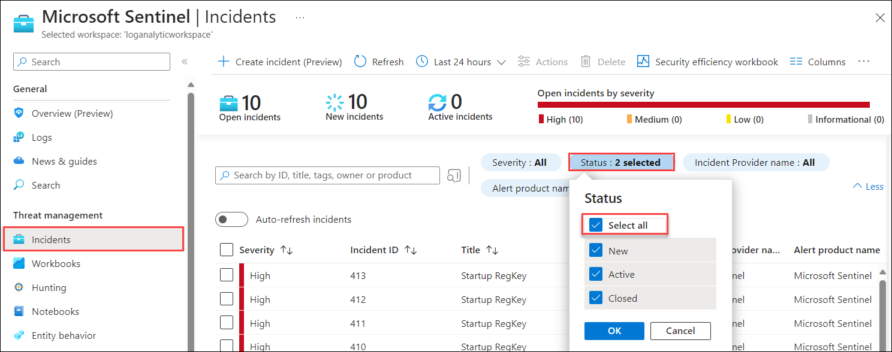
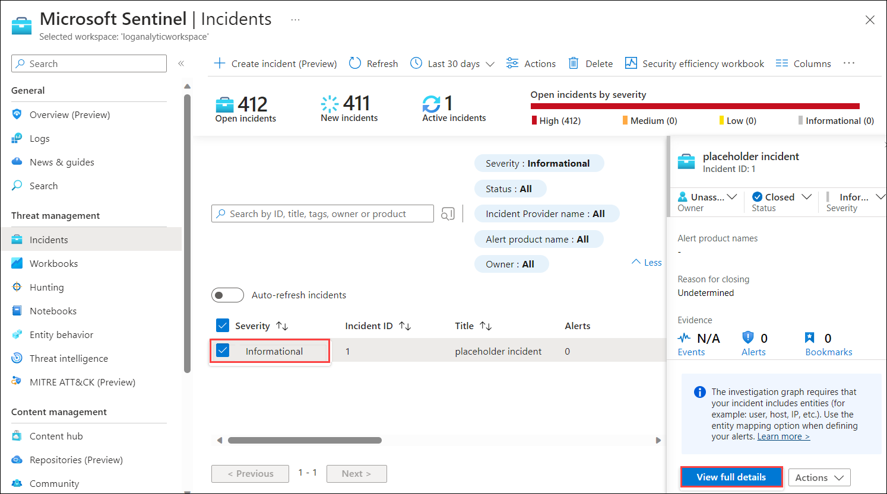

# Lab 01 - Review and explore sentinel workspace

## Lab scenario

In this lab, participants will explore a pre-configured Azure Sentinel workspace, investigating security incidents, configuring automated responses, and analyzing data to strengthen threat detection and response capabilities within the Azure environment.

You are a Security Operations Analyst working at a company that is implementing Microsoft Defender for Endpoint. Your manager plans to onboard a few devices to provide insight into required changes to the Security Operations (SecOps) team response procedures.
You start by initializing the Defender for the Endpoint environment. Next, you onboard the initial devices for your deployment by running the onboarding script on the devices.

## Lab objectives
 In this lab, you will perform the following:
 - Task 1: Log in to Azure Portal
 - Task 2: Explore Sentinel workspace
 - Task 3: Onboard a Device

## Estimated timing: 30 minutes

## Architecture Diagram

  

## Exercise 1: Exploring a Pre-Created Azure Sentinel Workspace

### Task 1: Log in to Azure Portal

1. If you are not login to the azure portal then in the virtual machine (VM) on the left, click on the Azure Portal, as shown below.

   
    
1. On the **Sign into Microsoft Azure** tab, you will see the login screen. Enter the following **Email/Username**, and then click on **Next**.

   * Email/Username: <inject key="AzureAdUserEmail"></inject>

     

1. Enter the following **Password** and click on **Sign in**. 
   
    * Password: <inject key="AzureAdUserPassword"></inject>

       
    
1. First-time users are often prompted to Stay Signed In. If you see any such pop-up, click on No.
   
1. If a **Welcome to Microsoft Azure** popup window appears, click on Maybe Later to skip the tour.

### Task 2: Explore Sentinel workspace

 Sentinel Workspace is a centralized platform by Microsoft Azure designed for managing, investigating, and responding to security threats across your organization's cloud services.

1. In the Search bar of the Azure portal, type *Microsft Sentinel*, then select **Microsoft Sentinel**.

    

1. Select the pre-created Sentinel **loganalyticworkspace** from the available list.

     

1. Explore the Overview page to obtain a summary of the workspace, including information on incidents, alerts, health, and other essential details.

    

1. Navigate to the 'Data connectors' section in the left sidebar and examine the currently configured connectors for collecting security-related data.

    

1. In the **threat management** section, choose **Incidents** from the left panel to assess detected security incidents and alerts.

1. Click on the status filter beside the search space, and then select the **Select all** checkbox to view all new, active, and closed incidents.

    

1. Select the **Informational** incident from the list to view details and take necessary actions.

     

    > **Congratulations** on completing the task! Now, it's time to validate it. Here are the steps:
    > - Click the Lab Validation tab located at the upper right corner of the lab guide section and navigate to the Lab Validation tab.
    > - Hit the Validate button for the corresponding task.
    > - If you receive a success message, you can proceed to the next task. If not, carefully read the error message and retry the step, following the instructions in the lab guide.
    > - If you need any assistance, please contact us at labs-support@spektrasystems.com. We are available 24/7 to help you out.

### Task 3: Onboard a Device

In this task, you will onboard a device to Microsoft Defender for Endpoint using an onboarding script.

1. If you are not already at the Microsoft 365 Defender portal in your browser, start the Microsoft Edge browser go to (https://security.microsoft.com).

1. On the **Sign into Microsoft Azure** tab, you will see the login screen. Enter the following **Email/Username**, and then click on **Next**.

   * Email/Username: <inject key="AzureAdUserEmail"></inject>

     

1. Enter the following **Password** and click on **Sign in**. 
   
   * Password: <inject key="AzureAdUserPassword"></inject>

      

    >**Note:** Take a moment to allow the option panel to fully load on the security portal."

1. Navigate to **Settings** in the left menu bar, and then, on the Settings page, choose **Endpoints**.

    

1. Navigate to the **Onboarding** option in the Device Management section.

    >**Note:** Device onboarding can also be initiated from the **Assets** section on the left menu bar. Expand 'Assets' and choose 'Devices.' On the Device Inventory page, with 'Computers & Mobile' selected, scroll down to find the option for **Onboard devices.** Clicking on this option will direct you to the **Settings > Endpoints** page.

1. In the '1. Onboard a device' section, ensure that 'Local Script (for up to 10 devices)' is visible in the Deployment method drop-down, then click the **Download onboarding package** button.

     

1. In the *Downloads* pop-up, use your mouse to select the 'WindowsDefenderATPOnboardingPackage.zip' file, and then click on the folder icon for **Show in folder**. **Hint:** If you can't locate it, the file should be in the 'c:\users\admin\downloads' directory.

    

1. Right-click on the downloaded zip file, choose **Extract All...**, ensure that **Show extracted files when complete** is checked, and then click **Extract**.

     

1. Right-click on the extracted file 'WindowsDefenderATPLocalOnboardingScript.cmd' and choose **Properties**. Tick the **Unblock** checkbox located in the bottom right of the Properties window, and then click **OK**.

     

1. Once again, right-click on the extracted file **WindowsDefenderATPLocalOnboardingScript.cmd** and opt for **Run as Administrator**. **Hint:** If the Windows SmartScreen window appears, click on **More info**, and then select **Run anyway**.
    
1. When the "User Account Control" window appears, select **Yes** to allow the script to run, answer **Y** to the question presented by the script, and press **Enter**. Once complete, you should see a message in the command screen that says *Successfully onboarded machine to Microsoft Defender for Endpoint*.

1. Press any key to continue. This action will close the Command Prompt window.

    

1. Back on the Onboarding page within the Microsoft 365 Defender portal, navigate to the "2. Run a detection test" section, and copy the detection test script by clicking the **Copy** button.

     

1. In the Windows search bar of the virtual machine, type **CMD**, and choose **Run as Administrator** from the right pane for the Command Prompt app.

1. When the "User Account Control" window appears, select **Yes** to allow the app to run. 

1. Paste the script by right-clicking in the **Administrator: Command Prompt** window and press **Enter** to run it. **Note:** The window closes automatically after running the script.

1. In the Microsoft 365 Defender portal, navigate to the left-hand menu, and under the **Assets** area, select **Devices**. If the device is not shown, proceed with the next task and return to check it later. It can take up to 60 minutes for the first device to be displayed in the portal.

     

    >**Note:** If you have completed the onboarding process and don't see devices in the Devices list after an hour, it might indicate an onboarding or connectivity problem.

    > **Congratulations** on completing the task! Now, it's time to validate it. Here are the steps:
    > - Click the Lab Validation tab located at the upper right corner of the lab guide section and navigate to the Lab Validation tab.
    > - Hit the Validate button for the corresponding task.
    > - If you receive a success message, you can proceed to the next task. If not, carefully read the error message and retry the step, following the instructions in the lab guide.
    > - If you need any assistance, please contact us at labs-support@spektrasystems.com. We are available 24/7 to help you out.
    
## Review
In this lab you have completed the following tasks:
 - Log in to Azure Portal
 - Explore Sentinel workspace
 - Onboard a Device
