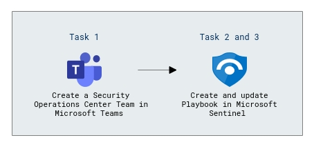
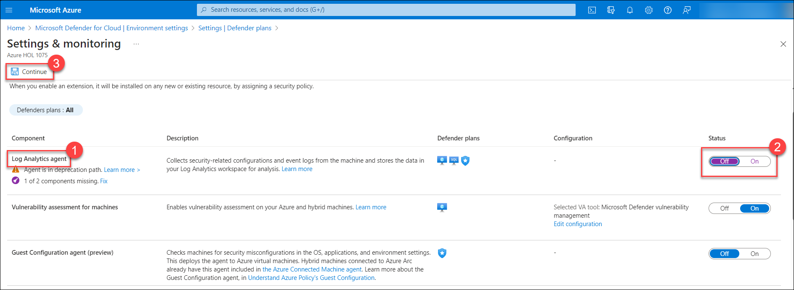
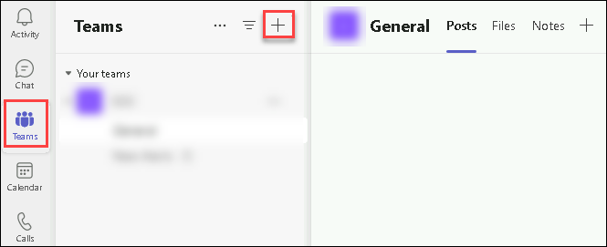
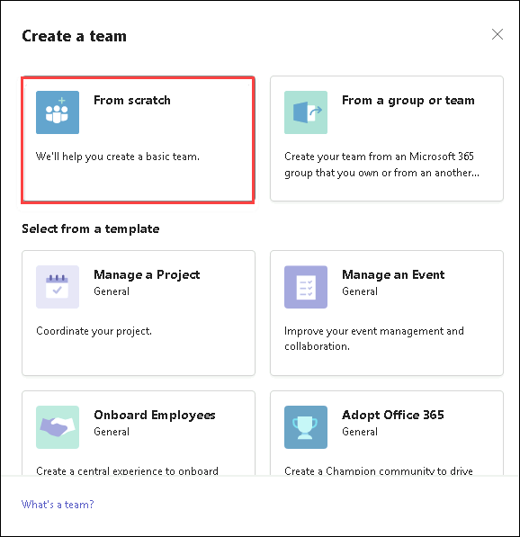
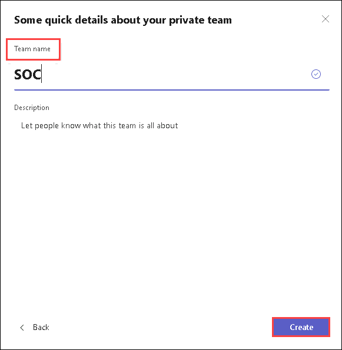
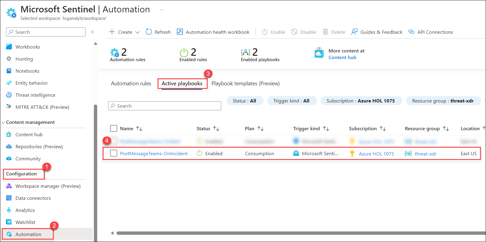
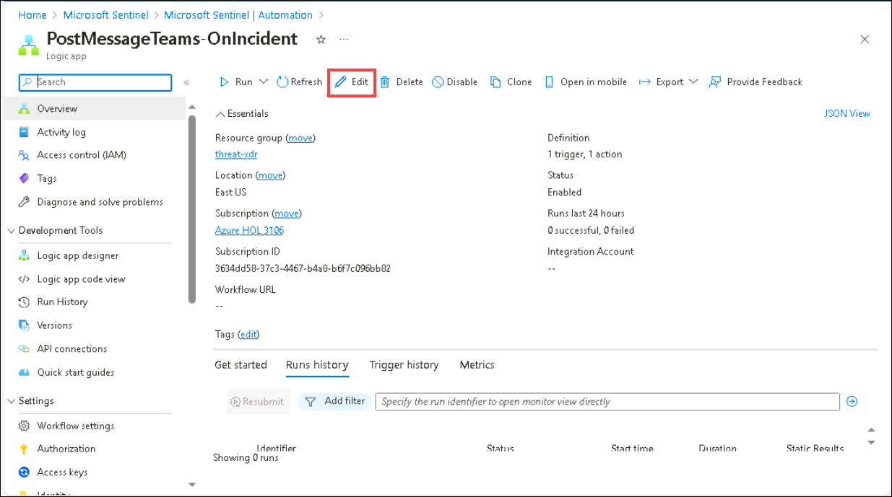
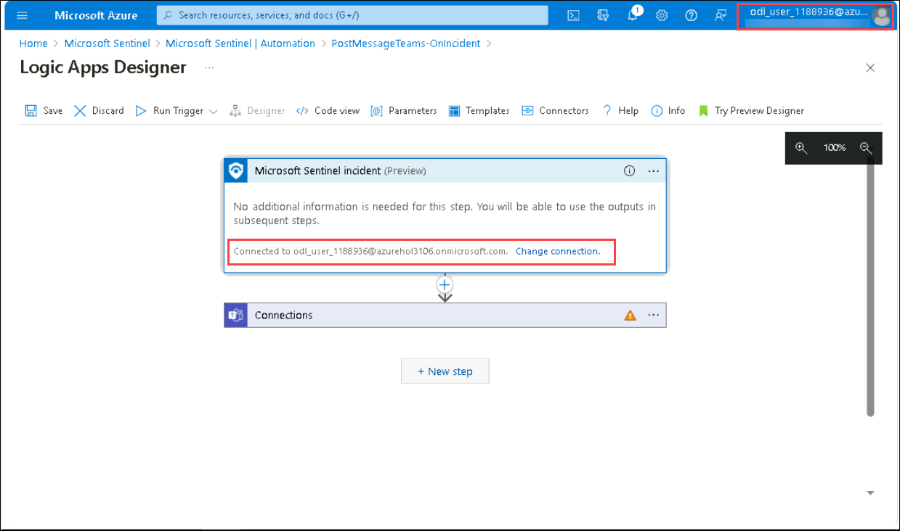
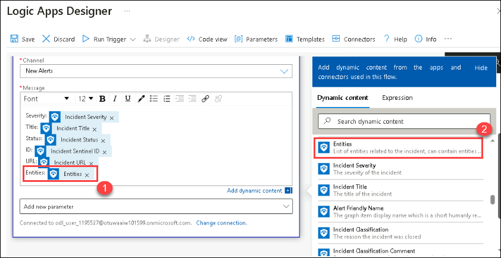
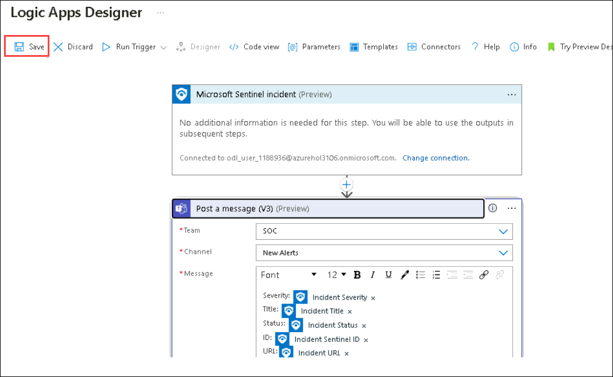

# Lab 02 - Integrate Logic App with Threat Protection and XDR

## Lab scenario

The integration of a Logic App with Threat Protection involves configuring triggers and actions to receive alerts, while interaction with XDR solutions requires adding actions to exchange data, perform analyses, and trigger responses. Implementing conditional checks and logic within the Logic App allows for tailored handling of received threat information, ensuring effective responses and workflow execution before thorough testing and deployment to production environments. 

## Lab objectives
 In this lab, you will perform the following:
 - Task 1: Connect the Windows security event connector
 - Task 2: Enable Microsoft Defender for Cloud
 - Task 3: Create a Security Operations Center Team in Microsoft Teams
 - Task 4: Create a Playbook in Microsoft Sentinel
 - Task 5: Update a Playbook in Microsoft Sentinel
 
## Estimated timing: 60 minutes

## Architecture Diagram
 

### Task 1: Connect the Windows security event connector

1. In the Search bar of the Azure portal, type *Microsft Sentinel*, then select **Microsoft Sentinel**.

     

1. Select the pre-created Sentinel **loganalyticworkspace** from the available list.

     

1. Navigate to the left menu and go to the Content Management section; there, select **Content Hub (1)**. On the Content Hub page, locate **Windows Security Events (2)**, and then **select (3)** it. Finally, click on **Install (4)**.

      

1. After receiving the notification of a successful installation, return to the Data Connector page and click on the refresh button to ensure that the changes take effect.

1. You should observe two options: **Security Events Via Legacy Agent** and **Windows Security Event Via AMA**.

1. Choose **Security Events Via Legacy Agent**, and then click on **Open Connector Page**.

     
   
8. In the configuration section, opt for **Install Agent on Azure Windows Virtual Machine (1)**, and then choose **Download & Install Agent for Azure Windows Virtual Machines (2)**.

     

9. Select the **svm-<inject key="DeploymentID" enableCopy="false" />** virtual machine and click on connect.

     
        
10. Once **connected (1)**, select the **Virtual Machine (2)** link from the top.

     

11. On the virtual machine page select the **s2vm-<inject key="DeploymentID" enableCopy="false" />** virtual machine and click on connect. wait until get connected.

    

11. Then, come back to the Configuration and scroll down a bit. You can find **Select which events to stream**. Click on **All Events**.

     

12. Click on Apply Changes now. If you refresh the data connector page, you can see the status Connected for **Security Events Via Legacy Agent**.

### Task 2: Enable Microsoft Defender for Cloud

In this task, you will enable and configure Microsoft Defender for Cloud.

1. In the search bar of the Azure portal, type *Defender*, then select **Microsoft Defender for Cloud**.

     

1. Click the left menu, and then click on **Getting Started**.

1. On the **Getting Started** page, under the **Upgrade** tab, ensure your subscription is selected, and then click the **Upgrade** button at the bottom of the page. Please wait for 2-5 minutes for the process to complete, as it may take some time.

     

4. In the left menu for Microsoft Defender for Cloud, under Management, select **Environment settings**.

1. Click on the subscription (or its equivalent name in your language). 

1. Review the Azure resources that are now protected with the Defender for Cloud plans.

1. Select the **Settings & Monitoring** tab from the Settings area (next to Save).
 
     

1. Review the monitoring extensions and confirm that **Log Analytics agent/Azure Monitor agent** is **Off**. Click Continue or close the Settings & Monitoring page by selecting the 'X' on the upper right of the page.

     

1. Close the settings page by selecting the 'X' on the upper right of the page to return to the **Environment settings**. Then, click on the '>' to the left of your subscription.

1. Select the Log Analytics workspace named **loganalyticworkspace** to review the available options and pricing.

     

1. Select **Enable all** (to the right of Select Defender plan), and then choose **Save**. Wait for the *"Microsoft Defender plan for workspace loganalyticworkspace was saved successfully!"* notification to appear.

    >**Note:** If the page is not being displayed, refresh your Edge browser and try again.  

1. Close the Defender plans page by selecting the 'X' in the upper right corner of the page to return to the **Environment settings**.

     

### Task 3: Create a Security Operations Center Team in Microsoft Teams.

In this task, you will create a team in Microsoft Teams for use in the lab.  

1. Access File Explorer and navigate to the directory **C:\LabFiles (1)**. Then, double-click on the named **MSTeams-86 (2)**. Allow a moment for the installation process to commence. Once installed, proceed to log in using the following credentials:

   - **Email/Username:** <inject key="AzureAdUserEmail"></inject>
   - **Password:** <inject key="AzureAdUserPassword"></inject>

   

1. select **Teams** on the left menu, then select **Join or create a team**.

     

1. Select the **Create Team** button in the main window.

1. Select the **From scratch** button.

      
       
1. Select the **Private** button.

     

1. Give the team the name: **SOC** and select the **Create** button.

      

1. In the Add members to SOC screen, select the **Skip** button. 

1. Scroll down the Teams blade to locate the newly created SOC team, select the ellipsis **(...)** on the right side of the name and select **Add channel**.
   
     

1. Enter a channel name as **New Alerts** then select the **Add** button.

    > **Congratulations** on completing the task! Now, it's time to validate it. Here are the steps:
    > - Click the Lab Validation tab located at the upper right corner of the lab guide section and navigate to the Lab Validation tab.
    > - Hit the Validate button for the corresponding task.
    > - If you receive a success message, you can proceed to the next task. If not, carefully read the error message and retry the step, following the instructions in the lab guide.
    > - If you need any assistance, please contact us at labs-support@spektrasystems.com. We are available 24/7 to help you out.

### Task 4: Create a Playbook in Microsoft Sentinel.

In this task, you will create a Logic App that is used as a Playbook in Microsoft Sentinel.

1. In the Microsoft Edge browser, open a new tab and paste https://github.com/Azure/Azure-Sentinel to nevigate to Microsoft Sentinel on GitHub.

1. Scroll down and select the **Solutions** folder.

1. Next select the **SentinelSOARessentials** folder, then the **Playbooks** folder.

1. Select the **Post-Message-Teams** folder.

1. In the readme.md box, scroll down to the *Quick Deployment* section, **Deploy with incident trigger (recommended)** and select the **Deploy to Azure** button.

     

1. Make sure your Azure Subscription is selected.

1. For Resource Group, select **threat-xdr** and select **OK**.

1. Leave **(US) East US** as the default value for *Region*.

1. Rename the *Playbook Name* to **PostMessageTeams-OnIncident** and select **Review + create**.

1. Now select **Create**.

    >**Note:** Wait for the deployment to finish before proceeding to the next task. It may take a couple of minutes to deploy.

### Task 5: Update a Playbook in Microsoft Sentinel.

In this task, you will update the new playbook you created with the proper connection information.

1. In the Search bar of the Azure portal, type *Sentinel*, then select **Microsoft Sentinel**.

1. Select your Microsoft Sentinel Workspace **loganalyticworkspace**.

1. Select the **Automation** from the Configuration area and then select the **Active Playbooks** tab, If **PostMessageTeams-OnIncident** is not visiable refresh the page and check.

1. Select the **PostMessageTeams-OnIncident** playbook and click on it to go to the logic App page.

     

1. On the Logic App page for *PostMessageTeams-OnIncident*, in the center menu, select **Edit**.
   
     

1. Select the *first* block **Microsoft Sentinel Incident(Preview)**.

1. Select the **Change connection** link.
   
    

1. Select **Add new** and select **Sign in**. In the new window, select your Azure subscription admin credentials when prompted. The last line of the block should now read “Connected to your-admin-username”.

1. Now select the *second block*, **Connections**.

1. Select **Add new** and select your Azure admin credentials when prompted. The last line of the block should now read “Connected to your-admin-username”.
   
     

1. The block has now been renamed to **Post a message (V3)**, at the end of the Team field, select the X to clear the contents. The field is changed to a drop-down with a listing of the available Teams from Microsoft Teams. Select **SOC**.

1. Do the same for the Channel field, select the **X** at the end of the field to clear the contents. The field is changed to a drop-down with a listing of the Channels of the SOC Teams. Select **New Alerts**. 

1. Under the **Message** section, type **Entities: (1)** and select **Entities (2)** dynamic content from the right panel.

   

1. Select **Save** on the command bar. The Logic App will be used in a future lab.
   
   
   
## Review
 In this lab you have completed the following tasks:
 - Connect the Windows security event connector
 - Enable Microsoft Defender for Cloud
 - Create a Security Operations Center Team in Microsoft Teams
 - Create a Playbook in Microsoft Sentinel
 - Update a Playbook in Microsoft Sentinel
