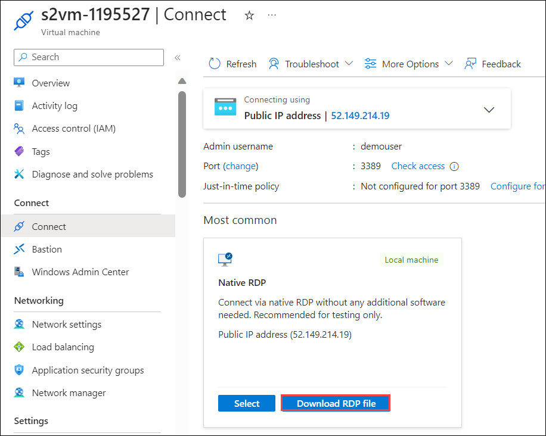

# Lab 03 - Conduct attacks

## Lab scenario

You are going to simulate the attacks that you will later use to detect and investigate in Microsoft Defender.

## Lab objectives
 In this lab, you will perform the following:
- Task 1: Persistence Attack with Registry Key Add
- Task 2: Command and Control Attack with DNS
- Task 3: Privilege Elevation Attack with User Add

## Estimated timing: 30 minutes

## Architecture Diagram

  

### Task 1: Persistence Attack with Registry Key Add 

>**Note:** Perform this task in your LAB-VM (svm).

1. In the search of the taskbar, enter *Command*. A Command Prompt will be displayed in the search results. Right-click on the Command Prompt and select **Run as Administrator**. Select **Yes** in the User Account Control window that allows the app to run.

1. In the Command Prompt, create a Temp folder in the root directory. Remember to press Enter after the last row:

    ```CommandPrompt
    cd \
    mkdir temp
    cd temp
    ```
   
1. Copy and run this command to simulate program persistence:

    ```CommandPrompt
    REG ADD "HKCU\SOFTWARE\Microsoft\Windows\CurrentVersion\Run" /V "SOC Test" /t REG_SZ /F /D "C:\temp\startup.bat"
    ```

    > **Congratulations** on completing the task! Now, it's time to validate it. Here are the steps:
    > - Click the Lab Validation tab located at the upper right corner of the lab guide section and navigate to the Lab Validation tab.
    > - Hit the Validate button for the corresponding task.
    > - If you receive a success message, you can proceed to the next task. If not, carefully read the error message and retry the step, following the instructions in the lab guide.
    > - If you need any assistance, please contact us at labs-support@spektrasystems.com. We are available 24/7 to help you out.

### Task 2: Command and Control Attack with DNS

>**Note:** Perform this task in your LAB-VM (svm).

1. Copy and run this command to create a script that will simulate a DNS query to a C2 server:

    ```CommandPrompt
    notepad c2.ps1
    ```

1. Select **Yes** to create a new file and copy the following PowerShell script into *c2.ps1*.

    >**Note:** Pasting into the virtual machine file might not show the full script length. Make sure the script matches the instructions within the *c2.ps1* file.

    ```PowerShell
    param(
        [string]$Domain = "microsoft.com",
        [string]$Subdomain = "subdomain",
        [string]$Sub2domain = "sub2domain",
        [string]$Sub3domain = "sub3domain",
        [string]$QueryType = "TXT",
        [int]$C2Interval = 8,
        [int]$C2Jitter = 20,
        [int]$RunTime = 240
    )
    $RunStart = Get-Date
    $RunEnd = $RunStart.addminutes($RunTime)
    $x2 = 1
    $x3 = 1 
    Do {
        $TimeNow = Get-Date
        Resolve-DnsName -type $QueryType $Subdomain".$(Get-Random -Minimum 1 -Maximum 999999)."$Domain -QuickTimeout
        if ($x2 -eq 3 )
        {
            Resolve-DnsName -type $QueryType $Sub2domain".$(Get-Random -Minimum 1 -Maximum 999999)."$Domain -QuickTimeout
            $x2 = 1
        }
        else
        {
            $x2 = $x2 + 1
        }    
        if ($x3 -eq 7 )
        {
            Resolve-DnsName -type $QueryType $Sub3domain".$(Get-Random -Minimum 1 -Maximum 999999)."$Domain -QuickTimeout
            $x3 = 1
        }
        else
        {
            $x3 = $x3 + 1
        }
        $Jitter = ((Get-Random -Minimum -$C2Jitter -Maximum $C2Jitter) / 100 + 1) +$C2Interval
        Start-Sleep -Seconds $Jitter
    }
    Until ($TimeNow -ge $RunEnd)
    ```

1. In the Notepad menu, select **File** and then **Save**. 

1. Go back to the Command Prompt window, enter the following command and press Enter.

    ```CommandPrompt
    Start PowerShell.exe -file c2.ps1
    ```
    
    
   
    >**Note:** You will see DNS resolve errors. This is expected.

    >**Important**: Do not close these windows. Let this PowerShell script run in the background. The command needs to generate log entries for some hours. You can proceed to the next task and next exercises while this script runs. The data created by this task will be used in the Threat Hunting lab later. This process will not create substantial amounts of data or processing.

### Task 3: Privilege Elevation Attack with User Add

>**Important:** The next steps are done on a different machine than the one you were previously working on. Look for the Virtual Machine name references.

1. In Azure portal, Search for **Virtual machines (1)** and select **Virtual machines (2)**.

   

1. Select the virtual machine **s2vm-<inject key="DeploymentID" enableCopy="false" />** from the list.
   
   

1. At the beginning of the virtual machine page, click on **Connect**, and from the drop-down select **Connect**.

   

1. On the Connect to Virtual Machine page, select RDP, Choose the option to **Download RDP File.**

   

1. Open the downloaded RDP file from the downloads.

   

1. Select Connect when prompted. You will get a warning that the .rdp file is from an unknown publisher. This is expected. In the Remote Desktop Connection window, select Connect to continue.

   
   
1. In the Windows Security window, select More Choices and then Use a different account. Enter **Username:** <inject key="Labvm Admin Username"></inject> and **Password:** <inject key="Labvm Admin Password"></inject> and then select OK.

   

1. Select **Yes** to verify the identity of the virtual machine and finish logging on.

    

1. You should now be connected to the virtual machine via Remote Desktop.

1. In the search of the taskbar of your **s2vm-<inject key="DeploymentID" enableCopy="false" />** VM, enter *Command*. A Command Prompt will be displayed in the search results. Right-click on the Command Prompt and select **Run as Administrator**. Select **Yes** in the User Account Control window that allows the app to run.

1. In the Command Prompt, create a Temp folder in the root directory. Remember to press Enter after the last row:

    ```CommandPrompt
    cd \
    ```
    ```CommandPrompt
    mkdir temp
    ```
    ```CommandPrompt
    cd temp
    ```

1. Copy and run this command to simulate the creation of an Admin account. Remember to press Enter after the last row:

    ```CommandPrompt
    net user theusernametoadd /add
    ```
    ```CommandPrompt
    net user theusernametoadd ThePassword1!
    ```
    ```CommandPrompt
    net localgroup administrators theusernametoadd /add
    ```

## Review
In this lab you have completed the following tasks:
- Persistence Attack with Registry Key Add
- Command and Control Attack with DNS
- Privilege Elevation Attack with User Add
