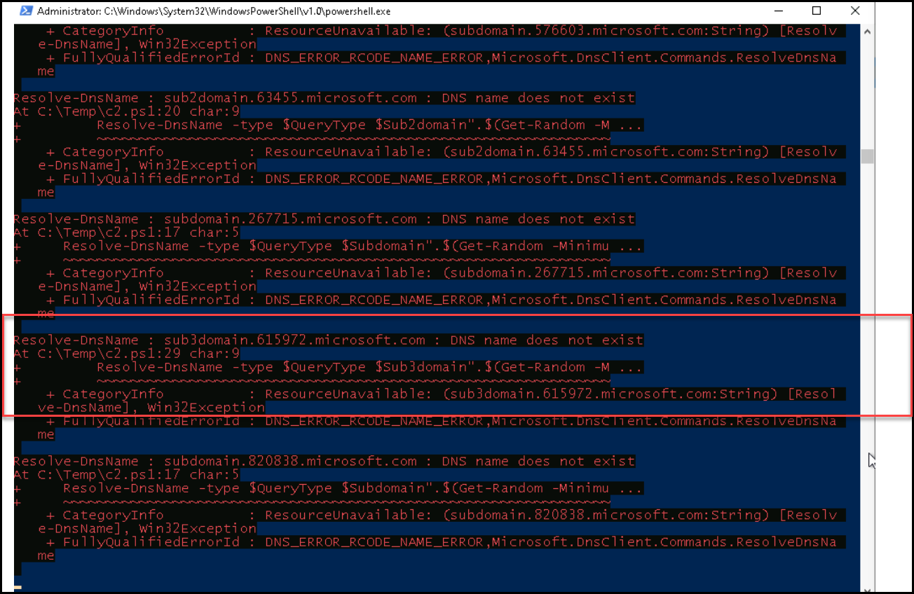

# Lab - 04 Conduct attacks

## Lab scenario

You are going to simulate the attacks that you will later use to detect and investigate in Microsoft Sentinel.

## Lab objectives
 In this lab, you will perform the following:
- Task 1: Persistence Attack with Registry Key Add 
- Task 2: Command and Control Attack with DNS
- Task 3: Privilege Elevation Attack with User Add

## Architecture Diagram

  

### Task 1: Persistence Attack with Registry Key Add 

1. Follow the instructions to log into WINServer again.

1. In the search of the task bar, enter *Command*. Command Prompt will be displayed in the search results. Right-click on the Command Prompt and select **Run as Administrator**. Select **Yes** in the User Account Control window that appears to allow the app to run.

1. In the Command Prompt, create a Temp folder in the root directory. Remember to press Enter after the last row:

    ```CommandPrompt
    cd \
    mkdir temp
    cd temp
    ```

1. Copy and run this command to simulate program persistence:

    ```CommandPrompt
    REG ADD "HKCU\SOFTWARE\Microsoft\Windows\CurrentVersion\Run" /V "SOC Test" /t REG_SZ /F /D "C:\temp\startup.bat"
    ```

### Task 2: Command and Control Attack with DNS

1. Copy and run this command to create a script that will simulate a DNS query to a C2 server:

    ```CommandPrompt
    notepad c2.ps1
    ```

1. Select **Yes** to create a new file and copy the following PowerShell script into *c2.ps1*.

    >**Note:** Pasting into the virtual machine file might not show the full script length. Make sure the script matches the instructions within the *c2.ps1* file.

    ```PowerShell
    param(
        [string]$Domain = "microsoft.com",
        [string]$Subdomain = "subdomain",
        [string]$Sub2domain = "sub2domain",
        [string]$Sub3domain = "sub3domain",
        [string]$QueryType = "TXT",
        [int]$C2Interval = 8,
        [int]$C2Jitter = 20,
        [int]$RunTime = 240
    )
    $RunStart = Get-Date
    $RunEnd = $RunStart.addminutes($RunTime)
    $x2 = 1
    $x3 = 1 
    Do {
        $TimeNow = Get-Date
        Resolve-DnsName -type $QueryType $Subdomain".$(Get-Random -Minimum 1 -Maximum 999999)."$Domain -QuickTimeout
        if ($x2 -eq 3 )
        {
            Resolve-DnsName -type $QueryType $Sub2domain".$(Get-Random -Minimum 1 -Maximum 999999)."$Domain -QuickTimeout
            $x2 = 1
        }
        else
        {
            $x2 = $x2 + 1
        }    
        if ($x3 -eq 7 )
        {
            Resolve-DnsName -type $QueryType $Sub3domain".$(Get-Random -Minimum 1 -Maximum 999999)."$Domain -QuickTimeout
            $x3 = 1
        }
        else
        {
            $x3 = $x3 + 1
        }
        $Jitter = ((Get-Random -Minimum -$C2Jitter -Maximum $C2Jitter) / 100 + 1) +$C2Interval
        Start-Sleep -Seconds $Jitter
    }
    Until ($TimeNow -ge $RunEnd)
    ```

1. In the Notepad menu, select **File** and then **Save**. 

1. Go back to the Command Prompt window, enter the following command and press Enter.

    ```CommandPrompt
    Start PowerShell.exe -file c2.ps1
    ```
    
      
   
    >**Note:** You will see DNS resolve errors. This is expected.

    >**Important**: Do not close these windows. Let this PowerShell script run in the background. The command needs to generate log entries for some hours. You can proceed to the next task and next exercises while this script runs. The data created by this task will be used in the Threat Hunting lab later. This process will not create substantial amounts of data or processing.

### Task 3: Privilege Elevation Attack with User Add

In this task, you will perform attacks on the host connected with Azure Arc that has the Azure Monitor Agent configured.

>**Important:** The next steps are done on a different machine than the one you were previously working on. Look for the Virtual Machine name references.

1. Go to Hyper-V manager. Connect to WINSERVER virtual machine.

1. Login to WINSERVER virtual machine as Admin with the password: **Password.1!!**.  

    >**Important:** The lab *SAVE* functionality can cause WINServer to become disconnected from Azure Arc. A reboot will solve the issue. 

1. Select **Start** in Windows. Then **Power**, next **Restart**.

1. Follow the instructions to log into WINServer again.

1. In the search of the taskbar, enter *Command*. A Command Prompt will be displayed in the search results. Right-click on the Command Prompt and select **Run as Administrator**. Select **Yes** in the User Account Control window that appears to allow the app to run.

1. In the Command Prompt, create a Temp folder in the root directory. Remember to press Enter after the last row:

    ```CommandPrompt
    cd \
    ```
    ```CommandPrompt
    mkdir temp
    ```
    ```CommandPrompt
    cd temp
    ```

1. Copy and run this command to simulate the creation of an Admin account. Remember to press Enter after the last row:

    ```CommandPrompt
    net user theusernametoadd /add
    ```
    ```CommandPrompt
    net user theusernametoadd ThePassword1!
    ```
    ```CommandPrompt
    net localgroup administrators theusernametoadd /add
    ```

## Review
In this lab, you have completed the following:
- Persistence Attack with Registry Key Add 
- Command and Control Attack with DNS
- Privilege Elevation Attack with User Add
