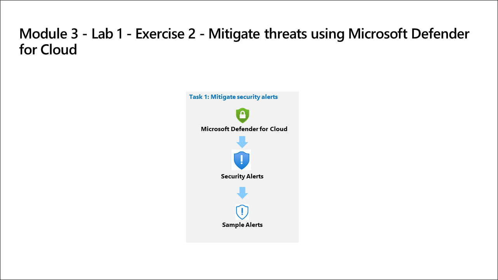
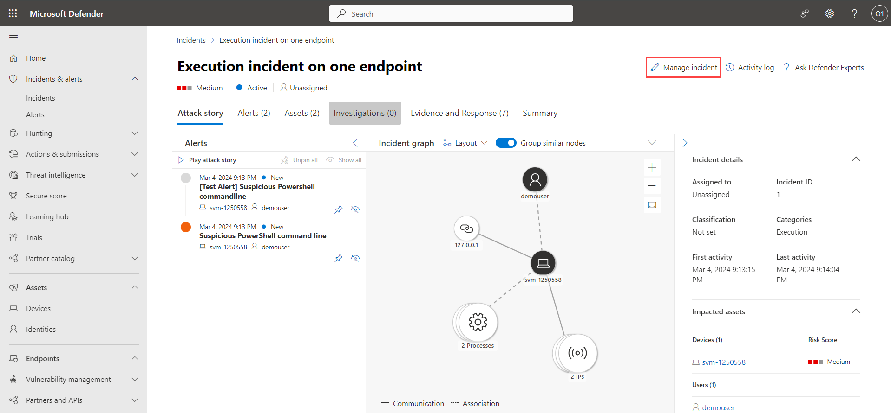
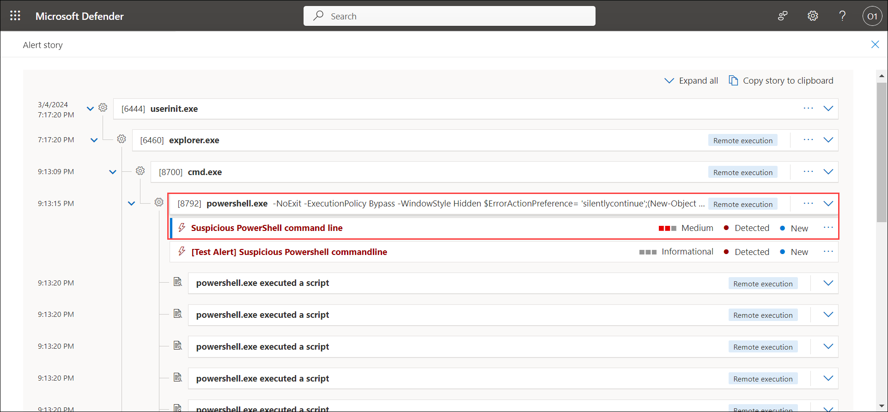
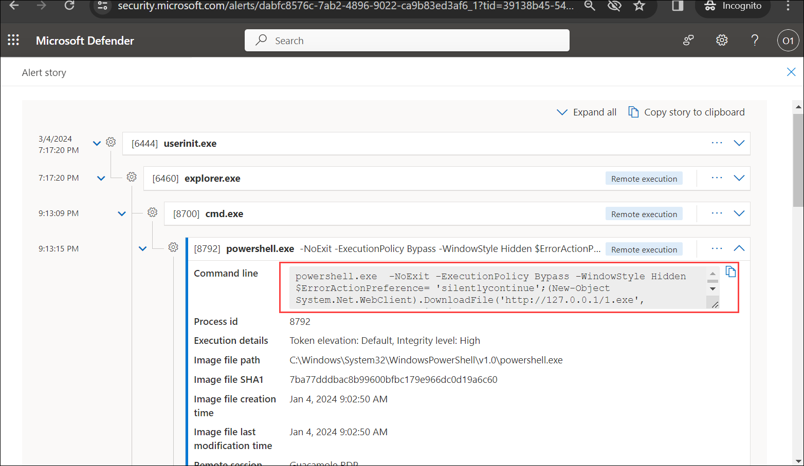
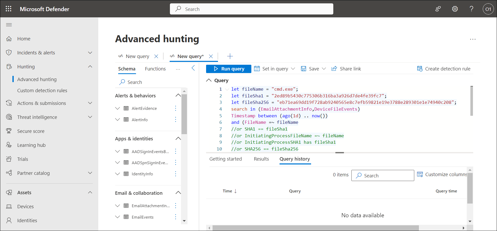
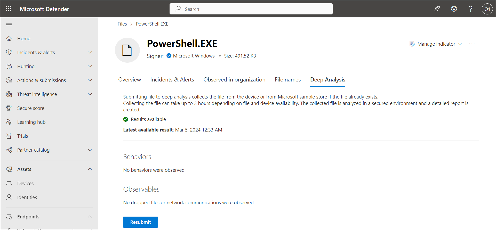

# Lab 10 - Mitigate threats using Microsoft 365 Defender

## Lab scenario

You're a Security Operations Analyst working at a company that implemented Microsoft Defender XDR solutions. You need to see the alerts in an incident to see the incident's full impact and do a root cause investigation and mitigate these alerts using M365 Defender tools.

## Lab objectives
 In this lab, you will perform the following in M365 Defender portal:
- Task 1: Manage Incidents
- Task 2: Investigate & Mitigate the Alerts

## Architecture Diagram

  
  
### Task 1: Manage Incidents

In this task, you will manage the incidents in M365 Defender portal.

1. If you are not already at the Microsoft 365 Defender portal in your Microsoft Edge browser, go to (https://security.microsoft.com). 

1. In the **Sign in** dialog box, copy and paste * Email/Username: <inject key="AzureAdUserEmail"></inject> and then select Next.

1. In the **Enter password** dialog box, copy and paste * Password: <inject key="AzureAdUserPassword"></inject> and then select **Sign in**.

1. From the sidebar menu, under **Incidents and Alerts**, select **Incidents**. Click on the incident **Multi-stage incident involving Execution & Discovery on one endpoint**.

1. To manage an incident, click on **Manage Incident** to edit the details of this incident.

   

1. Here, you can edit the name of the incident, add tags, assign to an existing group or an user, change the status, classify the incident as required and even add comments.

   

1. In the incident, the **Attack Story** tab provides a summary of the alerts and the incident graph on how these alerts are mapped.

   

1. You can further investigate these alerts by navigating to the **Alerts** tab.

   

1. You can also see the devices and users affected by this incident in the **Assests** tab. You can verify that the affected device is **svm-xxxx** and the user is **demouser**.

   

1. The **Evidences & Responses** tab shpws the initial evidences investigated by Microsoft Defender which includes the processes, IP addresses and registry values.

   

1. The **Summary** tab gives us a summarized report of the incident including acitve alerts & their category, incident information, scope and much more.

   

### Task 2: Investigate & Mitigate the Alerts

In this task you will investigate and mitigate the alerts through recommendations by Microsoft Defender.

1. In the Microsoft Defender portal, navigate to **Alerts** tab from the sidebar menu.

   

1. You can click on any of these alerts to view the full details. Click on the alert named **Suspicious System Network Configuration Discovery**. You will now investigate and mitigate this alert.

1. Click on **Maximize** to view the full alert details.

   

1. Click on the dropdowm for the first suspicious behaviour to fully investigate the root cause for this activity.

   

1. You can see that this suspicious behaviour was reported when the user ran a certain command. 

   

1. Click on the ellipses and then select **Go Hunt**. This will redirect you to a new tab of **Advanced Hunting** where you can run the query and get the results to mitigate the alert.

   

   

1. You can also investigate the alert further by navigating back the alerts and clicking on **Deep analysis**.

   

1. You will be redirected to a new tab. Click on **Submit** to get the detailed analayzed file.

   

1. This process will take sometime, after which you can see the deep analysis of the alert and further mitigate it.

   

1. Microsoft Defender also provides recommendations to mitigate the alerts. On the alert details page, click on **Recommendations** tab to view all the recommendations on mitigating this alert.

   

## Review
In this lab, you have completed the following:
- Manage Incidents
- Investigate & Mitigate the Alerts
