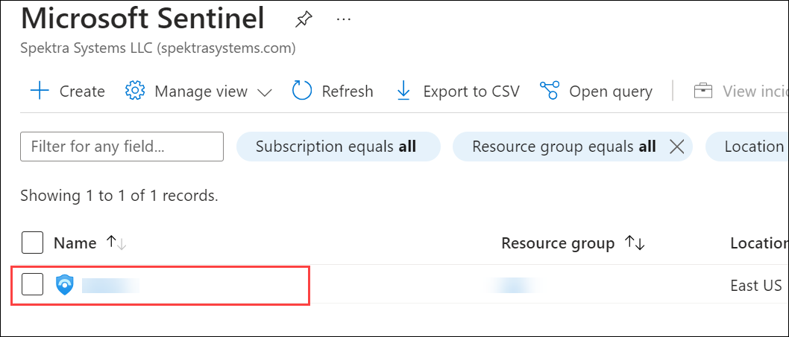
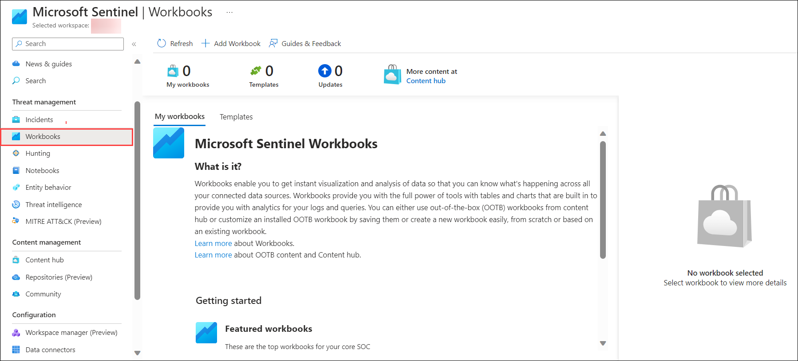
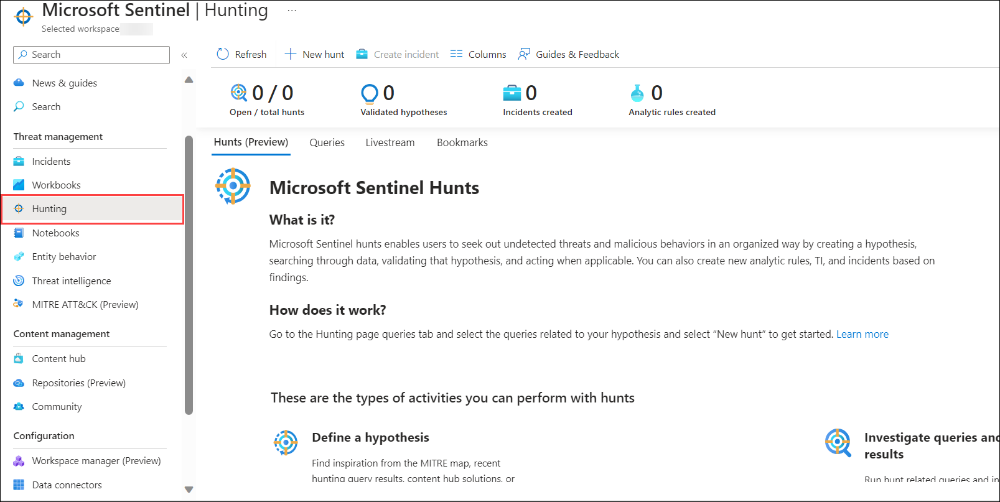
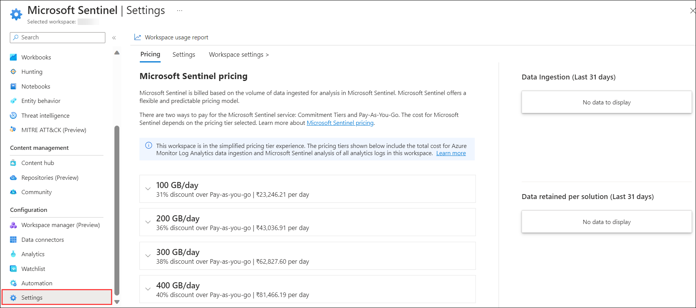

# Lab 12 - Review and explore sentinel workspace

## Lab scenario

In this lab, participants will explore a pre-configured Azure Sentinel workspace, investigating security incidents, configuring automated responses, and analyzing data to strengthen threat detection and response capabilities within the Azure environment

## Lab objectives
 In this lab, you will perform the following:
 - Task 1: Review Overview
 - Task 2: Explore Data Connectors
 - Task 3: Check Incidents and Alerts
 - Task 4: Explore Workbooks and Dashboards
 - Task 5: Hunt for Threats
 - Task 6: Configure Playbooks (Automation)
 - Task 7: Customize Settings
 
## Estimated timing: 60 minutes

## Architecture Diagram

### Exercise 1: Exploring a Pre-Created Azure Sentinel Workspace

1. In the Search bar of the Azure portal, type *Sentinel*, then select **Microsoft Sentinel**.

    

1. Choose the pre-created Sentinel workspace from the available list.

    

**Task 1: Review Overview**

1. Explore the Overview page to get a summary of the workspace, including incidents, alerts, health, and other essential information.

   

**Task 2: Explore Data Connectors**

1. Navigate to "Data connectors" on the left sidebar.

1. Review existing connectors configured for collecting security-related data.

   

**Task 3: Check Incidents and Alerts**

1. Visit the "Incidents" and "Alerts" sections to review detected security incidents and alerts.

1. Investigate incidents, view details, and take necessary actions.

    

**Task 4: Explore Workbooks and Dashboards**

1. Access "Workbooks" or "Dashboards" to view pre-configured reports or create new visual representations of security data.

   

**Task 5: Hunt for Threats**

1. Navigate to the "Hunting" section to run custom queries against data sources and search for potential threats or suspicious activities.

   

**Task 6: Configure Playbooks (Automation)**

1. Review and configure Playbooks in the dedicated section for automated responses to alerts or incidents.

    

**Task 7: Customize Settings**

1. Access the "Settings" section to review and adjust configurations related to data collection, connectors, analytics, and automation.

   

### Conclusion:
By completing these tasks, you will have systematically explored and reviewed the functionalities and features of the pre-created Azure Sentinel workspace in the Azure Portal.

## Review

In this lab you have completed:

- Reviewed Workspace Overview: Explored the Overview page for a summary of incidents, alerts, and overall workspace health.
- Explored Data Connectors: Examined existing connectors responsible for collecting security-related data.

- Checked Incidents & Alerts: Investigated security incidents and alerts, understanding detected threats and issues.

- Explored Workbooks & Dashboards: Accessed pre-configured reports or created new visualizations for security data.

- Hunted for Threats: Used the "Hunting" section to run custom queries against data sources to identify potential threats.

- Configured Playbooks: Reviewed and potentially configured Playbooks for automated responses to incidents.

- Customized Workspace Settings: Accessed settings to review and adjust configurations related to data collection, analytics, and automation.